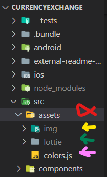

# Currency-Exchange

    An React Native application that provides watching currency exchange rates and exchanging them. 

    On this app you can do:
    - Singup via tckn, phone num, full name, date of birth..
    - Login via boimetrics(fingetprint) or tckn and password
    - Check recent transactions
    - Watching exchange rates also personalize watchlist
    - Exchange currencys
    - Creating Accounts
    - And more and more..

***

## Index
- [Local-Development](#local-development)
- [Customize](#customize)
- Page by page [Usage-Guideline](#usage-guide)
    - [Welcome](#welcome)
    - [SignUp](#signup)
    - [Login](#login)
    - [History](#history)
    - [Accounts](#accounts)
    - [Create-Account](#create-account)
    - [Watchlist](#watchlist)
    - [Edit-Watchlist](#edit-watchlist)
    - [Exchange](#exchange)
    - [Settings](#settings)
- [Features](#features)
- [Future-Improvements](#future-improvements)
- [Issues](#issues)

***
## Local Development
    To install the dependencies, run: npm install
    To run a on a Android Development Emulator: npm run android

***
## Customize
    While we are devoloping this project, we considered that it is easy to customize
    - To change page styles you can use seperate style files
    - To add new language support you can add new lang file to src/locales directory dont forget to update src/localesindex.js and settings page
    - To add and change images you can use src/assets/img folder (as shown below with yellow arrow)
    - To add and change lottie animations you can use src/assets/lottie folder (as shown below with green arrow)
    - To add and change applicatin colors you can use src/assets/colors.js file (as shown below with pink arrow)
 

***
### Usage Guide
#### Welcome
#### SignUp
#### Login
#### History
#### Accounts
#### Create Account
#### Watchlist
#### Edit Watchlist
#### Exchange
#### Settings
***
### Features

***
### Future Improvements
- splash screen (react-native-splash-screen)
- scroll on keyboard (react-native-keyboar-scroll-view)
- sounds effects (react-native-sound)
- copy IBAN to clipboard on double tap
- Dekont PDF (react-native-html-to-pdf react-native-print)
- share app and iban via QR code (react-qr-code)
- send e-mail and sms (react-native-communications)
- notifications

***
### Issues
